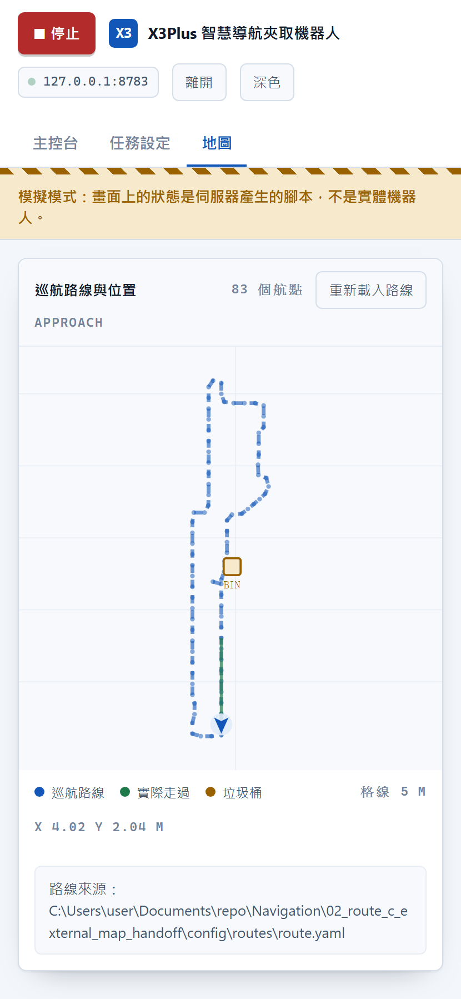

# iGibson Navigation & Grasping

[](https://github.com/koala915/iGibson-Navigation-Grasping/actions/workflows/tests.yml)
[](LICENSE)
[](#快速開始)

> 透過機器視覺與強化學習，讓一台 Yahboom X3Plus 從環境感知、自主避障導航，
> 到精準夾取物品並投入垃圾桶 —— 完整跑完一輪，不需要人在終端機前面。

**Sim-to-real deployment of a PPO 6-DOF grasping policy on a Yahboom X3Plus
(mecanum base + 5-DOF arm, Jetson Nano).** A YOLOv11 arm camera locates the
object, a PPO policy aligns and closes the jaw by contact detection, and a
20-state mission machine drives the patrol → detect → approach → grasp →
deliver loop. Everything runs in one Python 3.8 process that owns the serial
port; a phone-friendly web console drives it. Trained in PyBullet, deployed on
real hardware — **first successful physical grasp: 2026-07-31.**

<p align="center">
  
  
  
</p>

---

## 這個專案在做什麼

機器人沿著預先錄好的路線巡航，用手臂相機找地上的目標物；找到就轉向、接近、
用 PPO 策略把夾爪對上去夾起來，帶到垃圾桶投放，然後回到路線上繼續巡。

```text
      ┌──────────── 巡航 route.yaml (117 waypoints) ────────────┐
      │                                                          │
      ▼                                                          │
  手臂相機 ──► YOLOv11 ──► bbox 幾何 ──► 目標 (x, y, z, height)   │
                                            │                    │
                                            ▼                    │
                             底盤接近 ──► home 姿勢鎖定座標        │
                                            │                    │
                                            ▼                    │
                    28D 觀測 ──► PPO 策略 ──► Rosmaster 伺服機指令 │
                                            │                    │
                          Stage 0 對位 → Stage 1 接觸夾持 → Stage 2 抬升
                                            │                    │
                                            ▼                    │
                                    送到垃圾桶投放 ───────────────┘
```

三種執行模式，共用同一套夾取核心與同一套狀態名稱：

| 模式 | 用途 | 入口 |
|------|------|------|
| **完整任務** | 巡航→辨識→接近→夾取→投放→續巡，20 狀態任務機 | [`integration/mission_pipeline.py`](integration/mission_pipeline.py) |
| **模式 A** | 自走夾取全流程（雙相機導航 → 夾取 → 驗證重試 ≤3） | [`integration/vision_grasp_pipeline.py`](integration/vision_grasp_pipeline.py) |
| **模式 B** | 除錯用：辨識與夾取拆成兩個行程，TCP 5555 傳座標 | [`integration/vision_grasp_bridge.py`](integration/vision_grasp_bridge.py) |
| **模式 C** | RL 導航避障（PPO + 48 束 LiDAR）→ 精對位 → 夾取 | [`integration/nav_rl_grasp_pipeline.py`](integration/nav_rl_grasp_pipeline.py) |

---

## 硬體與技術棧

| 項目 | 內容 |
|------|------|
| **底盤／手臂** | Yahboom X3Plus：麥克納姆輪底盤 + 5-DOF 機械臂 + 夾爪 |
| **運算** | Jetson Nano（JetPack），Rosmaster 擴充板經 `/dev/myserial` |
| **夾取策略** | Stable-Baselines3 PPO，28D 觀測 / 6D 動作，incremental 控制 |
| **物理** | PyBullet（**僅用於 FK**，headless，不跑模擬） |
| **視覺** | YOLOv11（Ultralytics），單類別 `sugarbox` |
| **定位** | AMCL + `/scan`，rosbridge 收發，odom 由輪速回推 |
| **操作介面** | 純標準函式庫的 HTTP + SSE 伺服器，手機瀏覽器即可操作 |

---

## 專案結構

```
grasp/          夾取：PPO 策略部署、伺服機控制、URDF/FK、安全閘
  v21/            ★ 現行夾取流程（唯一在實機夾取成功過的版本）
  x3plus/         PyBullet FK 用的 URDF 與 meshes
detection/      辨識：YOLOv11 手臂相機、bbox→距離幾何、相機校正
integration/    整合：任務機、路線、里程計、ROS I/O、四種執行模式
ui/             操作台：手機/筆電網頁介面、任務程序監督、安全閘
tests/          跨模組回歸測試
model_tools/    模型打包、驗證、發佈流程
docs/           校正計畫、交接文件、規劃與操作清單
```

各資料夾的檔案逐項說明見 [`CLAUDE.md`](CLAUDE.md)；程式碼導覽見 [`INDEX.md`](INDEX.md)。

---

## 快速開始

需求：Python 3.8（Jetson 上）、`/dev/myserial` 可用、Rosmaster_Lib 已本地化。

```bash
# 1) 安裝相依
pip install -r grasp/requirements_jetson.txt
pip install -r detection/requirements_detection.txt

# 2) 本地化 Rosmaster 驅動（解決 Py3.8 找不到 Py3.6 驅動）
cd grasp && cp -r /usr/local/lib/python3.6/dist-packages/Rosmaster_Lib .
```

**上機前必跑的檢查**（不驅動硬體）：

```bash
./grasp/v21/jetson_verify.sh
```

**先空跑，目視確認角度合理，再接伺服機**：

```bash
python3 grasp/v21/x3plus_real_grasp.py --model grasp/v21/models/candidate_v21_seed816_ckpt550000.zip --vecnorm grasp/v21/models/candidate_v21_seed816_ckpt550000_vec.pkl --contract obs_28_incremental --object-height 0.03 --obj-x 0.2563 --obj-y -0.0035 --obj-z 0.015
```

**操作台**（開發機無硬體也能跑）：

```bash
python3 ui/server.py --simulate
```

完整的部署指令、旗標說明與各模式差異見 [`CLAUDE.md`](CLAUDE.md) 與
[`integration/README.md`](integration/README.md)。

---

## 測試

沒有硬體也能全部跑完 —— 這些測試刻意不需要機器人：

```bash
python3 grasp/v21/test_deploy_controller.py    # 119 checks — 部署控制器
python3 grasp/v21/test_servo_read.py           #  37 checks — 半雙工匯流排讀取
python3 grasp/v21/test_deploy_floor_guard.py   # 641 checks — 預防式地板防護
python3 ui/test_server.py                      #  47 tests  — 操作台伺服器
python3 tests/test_safety_guards.py            #  63 tests  — 安全閘
python3 tests/test_mission_end_to_end.py       #  23 tests  — 任務層端到端
```

再加上三支純邏輯自測（免相機、免硬體、免 torch）：

```bash
python3 integration/mission_fsm.py --selftest
python3 integration/mission_pipeline.py --selftest
python3 integration/vision_grasp_pipeline.py --selftest
```

---

## 安全設計

這個專案會驅動一台會自己移動的機器人，所以幾個閘門是刻意做死的：

- **空跑優先。** 沒有 `--real` 一律只印出指令，不送伺服機。首次連接務必先空跑。
- **兩道獨立的閘才能驅動硬體。** 操作台需要 `--allow-real` 啟動（有人在機器人旁邊
  下的指令），**且**該次請求帶著操作者勾選的確認。
- **v21 權重目前是 `candidate`**，`--real` 必須額外帶 `--unlock-candidate-real`，
  且須有人在場、手放電源開關。
- **預防式 FloorGuard**：在指令送出前就擋下會讓夾爪穿地板的動作，而不是事後回報。
- **接觸式夾持**：偵測到「指令走了但角度沒跟上」即停在接觸角，不再往全閉硬推 ——
  這是夾持力來源，也是齒輪研磨的防線。
- **真正的急停是電源開關**，網頁上的停止鈕送的是 `SIGINT`（走任務自己的關機路徑
  才會把輪子歸零），介面上也是這樣寫的。

---

## 已知限制

誠實記錄，不是待辦清單：

- **URDF 手指比實體長 16.7 mm**，尚未修（要等 v22 重訓）。所以紙球、瓶蓋這類
  矮物體目前夾不到。
- **v21 尚有三個硬體 gate 未通過**（`guard_margin_8mm_validated_on_hardware`、
  `c3_real_reach_envelope`、`object_heights_measured`），因此 manifest 狀態仍是
  `candidate` 而非 approved。
- **手臂相機裝在 `arm_link4` 會跟著手臂動**，固定高度／俯仰角只在 home 姿勢成立，
  所以視覺夾取一定要在 home 鎖定一次座標。
- **操作台刻意不顯示相機畫面** —— Jetson Nano 的 RAM 已經吃到九成，在控制迴路裡
  編 JPEG 是成本最高的一項。這是設計決定，不是缺功能。
- **v21 與 v17 的權重不可混用**：v21 是 incremental、v17 是 absolute，兩者 shape
  都是 28D/6D，任何 shape 檢查都抓不到，混用手臂會暴走。

---

## 文件

| 文件 | 內容 |
|------|------|
| [`CLAUDE.md`](CLAUDE.md) | 完整檔案結構、部署指令、關節映射、觀測空間、三段式控制 |
| [`INDEX.md`](INDEX.md) | 程式碼導覽：找對檔案不用掃全專案 |
| [`TROUBLESHOOTING.md`](TROUBLESHOOTING.md) | 踩過的坑：症狀 → 原因 → 解法 → 教訓 |
| [`progress.md`](progress.md) | 開發進度與實機測試紀錄 |
| [`integration/MISSION.md`](integration/MISSION.md) | 完整任務流程與狀態機 |
| [`integration/NAV_RL.md`](integration/NAV_RL.md) | 模式 C 的 RL 導航設計 |
| [`docs/calibration/`](docs/calibration/) | 相機／底盤校正計畫與量測值、手臂姿態設計 |
| [`docs/operations/`](docs/operations/) | 上機檢查清單、開機設備檢查、模式 B 測試計畫 |
| [`docs/handoff/`](docs/handoff/) | 訓練端／部署端交接文件 |
| [`docs/planning/`](docs/planning/) | 任務規劃、訓練需求、模型發佈流程 |

---

## 授權

[MIT](LICENSE)
