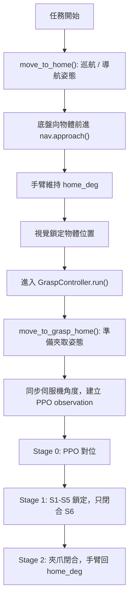

# Arm Pose Flow

本文說明 X3Plus 實機部署時，手臂在「導航靠近物體」到「PPO 夾取」之間的姿態流程。重點是分清楚兩個 home：

- `home_deg`：巡航 / 導航姿態。底盤向物體前進時使用。
- `grasp_home_deg`：準備夾取姿態。進入 PPO 夾取策略前使用，應對應 6D 訓練環境的初始手臂姿態。

這兩個姿態的用途不同，不應混成同一個概念。

## 姿態角色

### 1. 巡航 / 導航姿態：`home_deg`

`home_deg` 是實機在導航、視覺對位、底盤前進時使用的穩定姿態。

目前部署程式中的預設值：

```python
home_deg = (90.0, 140.0, 0.0, 0.0, 90.0, 30.0)
```

用途：

- 開始任務前，先把手臂收回到穩定位置。
- 底盤向物體前進時，手臂維持這個姿態。
- 視覺偵測與導航過程中，不讓手臂頻繁變動。
- Stage 2 回收時，手臂回到 `home_deg[:5]`，夾爪維持閉合。

這個姿態是「移動時的安全姿態」，不是 PPO 訓練時的夾取初始姿態。

### 2. 準備夾取姿態：`grasp_home_deg`

`grasp_home_deg` 是實機準備進入 PPO 夾取策略前的手臂姿態。

它的職責是讓實機手臂在 PPO 第一個 observation 送入模型前，站到和訓練環境初始狀態一致或等價的位置。

在程式流程中，真正切換到這個姿態的位置是：

```python
controller.servo.move_to_grasp_home()
controller._sync_joint_state_from_servos()
```

也就是說，PPO 開始輸出 action 之前，實機會先移到 `grasp_home_deg`，再同步目前伺服機角度，建立第一筆 observation。

目前本地程式已經把 `home_deg` 和 `grasp_home_deg` 分開，後續要調整準備夾取姿態時，應該改 `grasp_home_deg`，不要改導航用的 `home_deg`。

> 重要備註（2026-07-02 更新）：`grasp_home_deg` 已定案並寫入 `DeployConfig`（commit bb51a61）：
> **(90.0, 32.704, 9.786, 32.704, 90.0, 30.0)**，即 v17 訓練環境 `home_arm_pose = (0.0, -1.0, -1.4, -1.0, 0.0)` rad
> 經校正映射 `hw(API) = 90 + sim_deg` 的換算值。因 Rosmaster API 對 S2/S3/S4 有鏡像（API = 180 − 物理角），
> Yahboom App 會顯示物理角 ≈ **[90, 147.3, 170.2, 147.3, 90]**（俯視前下壓：相機看前方地面、夾爪懸在放物區上方）。
> 剩餘驗證：首次 `--real` 前先 dry-run 核對角度輸出，再低速上機用 App 讀值與目視確認（見下方校正原則）。

### 3. Stage 1 夾取鎖定姿態

Stage 1 不是一個固定設定值，而是執行時的快照。

當策略判斷進入 Stage 1 時，程式會記錄當下的 S1-S5：

```python
_stage1_arm_hold = current S1-S5
```

接著 Stage 1 只會閉合夾爪 S6，S1-S5 維持不動。

這代表真正執行閉爪時，手臂姿態是 Stage 0 PPO 對位後到達的位置，而不是 `home_deg` 或 `grasp_home_deg` 的固定值。

### 4. Stage 2 回收姿態

Stage 2 會讓手臂回到巡航 / 導航姿態，但夾爪保持閉合：

```python
home_deg[:5] + [closed_gripper]
```

因此 Stage 2 的目標是「帶著物體回收」，不是重新張開夾爪或回到準備夾取姿態。

## 整體流程

### 視覺導航整合流程

`integration/vision_grasp_pipeline.py` 的整體流程如下：

1. 手臂先移到巡航 / 導航姿態 `home_deg`。
2. 底盤開始向物體前進，執行 `nav.approach()`。
3. 前進過程中，手臂維持 `home_deg`，不切換成夾取姿態。
4. 視覺系統鎖定物體位置，取得物體相對座標。
5. 進入 `controller.run()`。
6. `controller.run()` 內部先切換到 `grasp_home_deg`。
7. 同步實際伺服機角度，建立 PPO 第一個 observation。
8. Stage 0：PPO 輸出 6D action，手臂對位，夾爪保持開啟。
9. Stage 1：達到閉爪條件後，鎖住 S1-S5，只閉合 S6。
10. Stage 2：夾爪保持閉合，手臂回到 `home_deg[:5]`。

流程圖：



### 單獨執行夾取腳本

如果直接執行 `grasp/x3plus_real_grasp.py`：

- 有使用 `--latch-obj` 時：
  - 先移到 `home_deg`。
  - 在導航 / 視覺姿態下取得物體位置。
  - 再切到 `grasp_home_deg`。
  - 接著進入 PPO Stage 0。

- 沒有使用 `--latch-obj` 時：
  - 不做導航鎖定。
  - 直接切到 `grasp_home_deg`。
  - 接著進入 PPO Stage 0。

## 6D 訓練初始姿態來源

目前 GitHub 最新版 `igibson_x3_test` 的 6D 訓練環境仍以 `training/x3plus_ground_grasp_env.py` 內的 `home_arm_pose` 作為訓練初始手臂姿態。

最新檢查到的 main commit：

```text
391b07952431009dbb758f8aafb2d878c847b950
```

訓練環境中的姿態設定：

```python
home_arm_pose = (0.0, -1.0, -1.4, -1.0, 0.0)
```

單位是 sim rad，對應 S1-S5，不包含夾爪 S6。

6D student 環境 `training/robot_grasp_env.py` 繼承這個 ground grasp environment，並使用：

- action space：6D
- observation space：28D
- previous action：6D

因此，實機部署時的 `grasp_home_deg` 應該對應這個訓練初始姿態，而不是導航時的 `home_deg`。

## 實機角度校正原則

目前本地部署程式以實際設定為準：

```python
arm_hw_invert = (False, False, False, False, False)
```

也就是 S1-S5 都使用同一套 API 方向：

```text
hw(API) = 90 + sim_deg
```

夾爪 S6 目前設定為：

```text
open = 30 deg
closed = 180 deg
```

但是要注意：GitHub 訓練 repo 內的舊部署檔與 README 仍可能保留舊版 sim-to-real 說明，例如 S2/S3/S4 方向未校正或舊的 invert 設定。因此準備夾取姿態不應直接照舊部署檔抄。

用 all-False 公式把 v17 訓練 sim pose 換算成 API 角度，得到：

```text
(90.0, 32.704, 9.786, 32.704, 90.0, 30.0)
```

這組值**已寫入 `DeployConfig.grasp_home_deg`**（commit bb51a61）。這條換算公式不是純數學推測——
`arm_hw_invert` 全 False + API 鏡像的結論已於 2026-05-25 在實機端到端驗證過（v5 模型正前方/左/右三點
全流程夾取成功，見 progress.md）。S3 的 API 值 9.8° 貼近下限 0° 看起來可疑，但那只是鏡像慣例：
物理角是 170.2°（貼近物理上限 180°），與 sim 中 S3 = −80.2°（貼近 URDF 極限 −90°）一致，
是這個俯視姿態本身就靠近關節極限，不是換算錯誤。

上機前的確認流程（value 已定，這是驗證不是重新校正）：

1. dry-run 確認 `move_to_grasp_home()` 輸出的目標角度 = `[90, 32.7, 9.8, 32.7, 90, 30]`。
2. `--real` 低速走到夾取 home，用 Yahboom App 對照讀值 ≈ `[90, 147, 170, 147, 90]`（物理角）。
3. 目視確認：相機看得到前方地面、夾爪張開懸在放物區（base 前方 x 0.17–0.33 m）上方。
4. 若目視與 App 讀值都符合，此姿態即為最終夾取 home；若不符，先懷疑 API 鏡像假設在該關節是否成立，
   不要直接改角度數字。

## 修改守則

後續調整手臂姿態時，請依照下面原則：

1. 底盤向物體前進時，只使用 `home_deg`。
2. 準備進入 PPO 夾取時，才切換到 `grasp_home_deg`。
3. `home_deg` 是導航安全姿態，不應為了修 PPO 夾取而任意改動。
4. `grasp_home_deg` 是 PPO 訓練初始姿態的實機對應值，應透過 dry-run 與目視校正。
5. 使用 `--nav-home-deg` 測試巡航姿態。
6. 使用 `--grasp-home-deg` 測試準備夾取姿態。
7. 確認角度合理後，再把校正後的值寫回 `DeployConfig.grasp_home_deg`。

## 驗證清單

調整姿態後，至少確認下列項目：

- dry-run log 中，導航前先出現 `move_to_home()` 或 navigation home。
- 底盤向物體前進時，手臂保持 `home_deg`。
- 進入 PPO 前，才出現 `move_to_grasp_home()`。
- PPO 第一個 observation 是在同步 `grasp_home_deg` 後建立。
- Stage 0 由 PPO 控制 S1-S6 進行對位。
- Stage 1 只閉合 S6，S1-S5 維持進入 Stage 1 當下的姿態。
- Stage 2 夾爪保持閉合，手臂回到 `home_deg[:5]`。

最重要的判斷標準是：導航時穩定、準備夾取時才切姿態、PPO 開始前的實機姿態要對得上訓練初始姿態。
