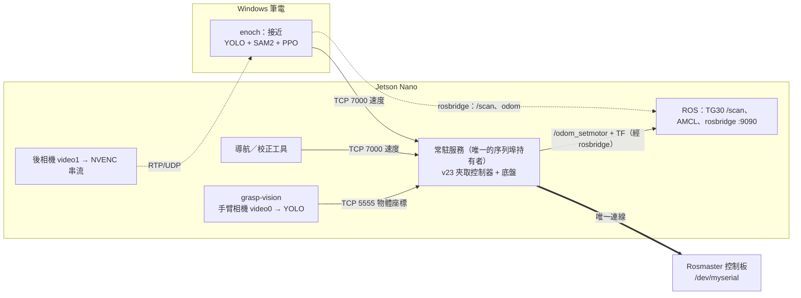

# G2 運作架構：一個常駐程式持有序列埠，對外提供兩個介面（2026-09-28 定案）

**決定**：Jetson 上只留**一個**常駐程式持有 `/dev/myserial`。它同時提供
**TCP 7000 速度指令**（格式跟現在的馬達服務完全一樣）與 **`graspctl` 夾取指令**，
並在程式內部強制「輪子與手臂不同時動」。導航、接近、夾取都變成它的用戶端。

負責人：G2 本體 koala915；導航端 112303577ncu；接近端 enoch20050427。

---

## 為什麼這樣定

**1. TCP 7000 已經是全隊的共同介面。** 會送速度指令到 7000 的程式有：enoch 的
`sugarbox_rl_approach_final2.py`、`detection/arm_center_setmotor.py`、
`detection/rear_nav/rear_to_arm_blind_handoff.py`、`detection/calibration/` 的底盤校正腳本
與 `detection/debug_tools/` 的除錯工具；2026-09-22 的導航硬體測試也是經
`x3plus-navigation` 的 7000 馬達服務進行。協定是一行一個 JSON（`{"vx":…,"wz":…}` 或
`{"action":"stop"}`），0.5 秒沒收到指令就停車。**讓持有序列埠的程式講同一個協定，
這些程式一行都不用改。**

另一類是 repo 內的 `mission_pipeline.py`、`nav_rl_grasp_pipeline.py`（模式 C）、
`vision_grasp_pipeline.py`（模式 A）：它們在程式內直接 `set_car_motion` 控車，並要求 7000
馬達服務**關閉**。它們在新架構裡的角色見「實作順序」第 6 步。

**2. 夾取常駐服務已經在機器上驗證過了。** `grasp/v23/grasp_service.py` 已經常駐持有
序列埠，所有安全閘在啟動時跑一次，實測夾取 7.2 秒、放下 4.6 秒、記憶體約 490 MB，
開機由 systemd 帶起。在它上面加底盤功能，比從頭寫一個新的主程式風險低。

**3. 跟原計畫的差異。** `GRASP_LATENCY_PLAN_2026-09-21.md` 的 G2 原本寫「把 v23 接進
`mission_pipeline.py`，不另外啟動 serial service」。那樣做的話，enoch 的接近程式和所有
7000 工具都得改寫成 `mission_pipeline` 內部的一段迴圈。**目標不變**（單一持有者、切換
不重啟、模型常駐），只是持有者改成常駐服務，任務流程改成用戶端。

---

## 架構

`graspctl`（`/tmp/grasp_service.sock`）是任務流程或操作員下夾取／放下指令的入口。

---

## 介面

| 介面 | 內容 | 狀態 |
|------|------|------|
| TCP 7000 | 一行一個 JSON；`vx`／`wz` 或 `action: stop`；0.5 s 看門狗；速度上限與死區沿用 `sugarbox_rl_motor_server.py` | **沿用，不改格式** |
| `graspctl` socket | `grasp`／`release`／`home`／`status`／`quit` | 沿用；`status` 加上底盤狀態 |
| `/odom_setmotor` + `odom→base_footprint` TF | `FeedbackOdomReader`（linear 0.98、angular 0.501）算出，20 Hz | 改由常駐服務發 |
| TCP 5555 | 視覺服務送物體座標 | 沿用 |

odom 用 rosbridge 發（`integration/ros_io.py` 的做法）：常駐服務跑在 Python 3.8 venv，
不能 import rospy。`mission_pipeline.py` 已經用同一種方式發 odom 與 TF。

---

## 程式內強制的安全規則

**R1 手臂動作前，底盤必須已停止 ≥ 0.5 秒。** 否則 `grasp`／`release`／`home` 直接回
`{"ok": false, "reason": "chassis_moving"}`，手臂不動。

**R2 手臂動作期間，底盤指令一律丟棄。** 開始動手臂前先送一次停車，整段手臂動作持有
硬體鎖；這段時間 7000 收到的速度指令不寫入控制板，只記錄並回報。

**R3 所有寫入控制板的動作共用一把硬體鎖。** 目前 v23 控制器沒有保護序列埠寫入的鎖，
輪子與手臂分在兩個執行緒時，封包可能交錯。odom 讀取來自 Rosmaster_Lib 的接收執行緒
快取，不寫入，不需要鎖。

**R4 看門狗與速度上限照舊**：0.5 秒沒指令停車；`RL_MOTOR_LIMIT = 30`。

**R5 啟動前的序列埠檢查照舊**：`deploy/systemd` 的 `check-serial-owner.sh`，佔用中就拒絕啟動。

**R6 急停仍是電源開關。** SIGINT 時先停車、手臂原地凍結，再釋放序列埠。

---

## 分工

**koala915（G2 本體）**
1. 在 `grasp/v23/grasp_service.py` 加上底盤功能（TCP 7000 伺服器、odom 發布、R1–R3）。
   啟動路徑與安全閘不動，沿用 launcher 的 `build_ctrl_cmd()`。
2. 速度換算直接 import `sugarbox_rl_motor_server.py` 的 `velocity_to_motor_values`，
   不再複製一份常數。
3. 開機預設的序列埠持有者就是這個服務；`x3plus-navigation.service` 保留給維修用，
   仍然互斥。

**112303577ncu（導航）**
1. 先把 fork 上 9/27 的 4 個 commit 開 PR 合進 `v23-grasp-test`（改到 `mission_pipeline.py`
   與 `sugarbox_rl_motor_server.py`，G2 要用）。
2. 經 7000 的導航與校正工具不用改。程式內直接控車的 `nav_rl.py`／`nav_rl_grasp_pipeline.py`
   （模式 C）要改成 7000 用戶端，或保留為與常駐服務互斥的獨立模式，由導航端決定。
3. 驗證 odom 改由 rosbridge 發之後，AMCL 與 TF 是否正常。

**enoch20050427（接近）**
1. 把 `codex/sugarbox-approach-review` 重新接到 `v23-grasp-test` 上。
2. 接近程式照舊送 TCP 7000、從 rosbridge 讀資料、收後相機串流，不用改。
3. 確認 Jetson 端的後相機串流是由哪個程式啟動，之後一併做成 systemd 單元。

**所有人**：`git config user.name / user.email` 設成自己的，現在兩個 fork 的 commit 都掛在
koala915 名下。

---

## 實作順序

1. 合併 112303577ncu 的 PR（前置條件）。
2. 常駐服務加上 TCP 7000 與 R1–R3。**先把車架起來、輪子離地**，用
   `detection/calibration/` 的工具送速度，確認輪子會轉、看門狗會停、手臂動作期間
   速度指令被擋下。
3. 加上 odom 發布，驗證 AMCL 與 TF。
4. 落地測：enoch 的接近程式開到盒子前 → `graspctl grasp` → `graspctl release`，
   中間不重啟任何服務。
5. G3 驗收（下一節）。
6. 最後再決定任務流程（巡航 → 接近 → 夾取 → 送桶 → 續巡）由誰來串：把
   `mission_pipeline.py` 改成 7000 + `graspctl` 的用戶端，或寫一支新的薄層。
   在那之前，`mission_pipeline.py`、模式 A、模式 C 維持現狀（直接控車、接 v21），
   與常駐服務互斥。這一步不影響前面五步。

---

## 驗收（G3）

連續 10 輪「接近 → 夾取 → 送到桶子 → 放下 → 回到巡航」，每輪檢查：

- `sudo fuser -v /dev/myserial` 永遠只有一個持有者；
- 沒有任何控制器、YOLO、PyBullet 重新載入的訊息；
- 從底盤停止到開始夾取不超過 1 秒（今天的兩服務切換是 11.6 秒）；
- 夾取約 7.2 秒、放下約 4.6 秒維持不變；
- 常駐服務 RSS 不持續上升；
- odom 在夾取前後連續，沒有歸零或 TF 跳變；
- 手臂動作期間，7000 收到的速度指令全部被擋下（看服務日誌）。

---

## 還沒解決、要留意的

- **odom 經 rosbridge 的延遲**：馬達服務原本用 rospy 發。如果 AMCL 對延遲敏感，備案是讓
  常駐服務把 odom 送到本機一支很小的 rospy 節點轉發。
- **記憶體**：常駐服務約 490 MB、視覺約 300 MB、ROS 全套約 570 MB，另加後相機串流。
  4 GB 放得下，但要在 G3 期間持續看剩餘記憶體。
- **放下時夾爪卡在半開**（2026-09-25 發生過一次）：控制器會凍結不收回。任務流程要能處理
  `release` 回傳 `aborted`，不能當成成功。
- **搬運途中掉落偵測不到**：2026-09-25 決定接受此風險，任務流程不要把 `released` 當成
  「確定投進桶子」。
