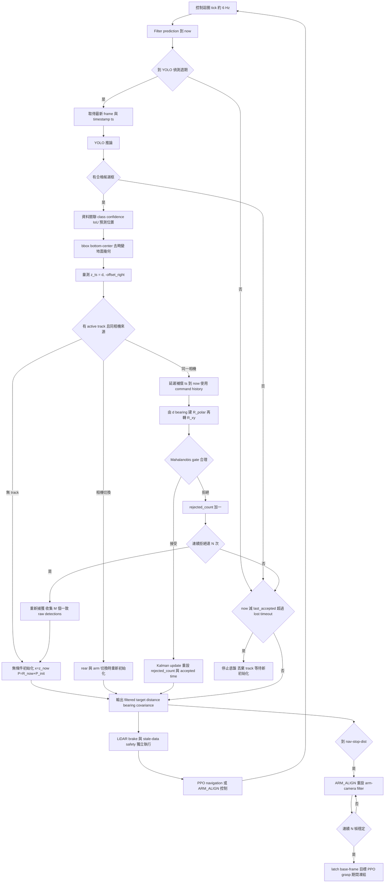

# YOLO 目標追蹤 Kalman Filter 設計規格

> 狀態：設計文件，尚未實作。
>
> 目標：在不改動 YOLO、PPO policy 與 LiDAR safety 的前提下，將 YOLO 抖動與短暫漏偵測轉為穩定的導航與手臂對位目標。

## 1. 放置位置

Kalman filter 不放在 YOLO 模型內，也不改 PPO observation 的意義；它放在相機幾何量測與導航／對位控制之間。

- `integration/vision_grasp_pipeline.py`：`_detect_rear()`、`_detect_arm()` 將 YOLO bbox 轉為 `distance`、`offset`；`LatestFrameReader` 提供 frame timestamp。
- `integration/nav_rl.py`：`GoalTracker` 已有命令速度 dead-reckoning，是未來 `KalmanGoalTracker` 的基礎。
- `integration/nav_rl_grasp_pipeline.py`：後鏡頭做 RL 導航，接近後交給 ARM_ALIGN，latch 後凍結目標座標。

第一版建議以 `KalmanGoalTracker` 取代或包裝 `GoalTracker`，維持原本 `dist()`、`bearing()` 的對外介面。

## 2. 座標與最小狀態

物體通常靜止，移動的是機器人。因此先使用 2D 位置狀態，不需要一開始就做 4D constant-velocity model：

```text
x = [target_x_forward, target_y_left]^T
```

視覺幾何的原始輸出為：

```text
d             = forward ground distance
offset_right  = camera lateral offset; right is positive
```

轉成 robot/base 相對座標的量測：

```text
z = [d, -offset_right]^T
```

狀態的 `+Y` 是左，與目前導航 bearing／PPO 的慣例一致。

## 3. 完整流程



## 4. Prediction：機器人移動，目標在車體座標中反向移動

令狀態 `p = [x, y]^T`，本次命令為 `vx`、`wz`，時間差為 `dt`：

```text
phi    = wz * dt
F      = R(-phi)
p_pred = R(-phi) * (p_prev - [vx * dt, 0]^T)
P_pred = F * P_prev * F^T + Q_motion
```

這與現有 `GoalTracker.predict()` 的座標變換一致。`Q_motion` 必須涵蓋命令速度不等於實際底盤速度，並在車速高、轉彎、stall assist、近障調速、LiDAR brake 或長時間 prediction 時提高。

## 5. 量測 R：先在極座標定義，再轉換為 Cartesian

地面幾何量測本質是距離 `d` 與方位 `bearing`，不是等向的 `(x, y)` 雜訊。

```text
R_polar = diag(sigma_d^2, sigma_bearing^2)
z_xy    = [d cos(bearing), d sin(bearing)]^T

J = [ cos(bearing), -d sin(bearing) ]
    [ sin(bearing),  d cos(bearing) ]

R_xy = J * R_polar * J^T
```

一般而言 `sigma_distance >> sigma_bearing`。bbox bottom y 的像素誤差經地面投影後，遠距離的距離誤差會迅速放大。應以實測資料擬合，例如：

```text
sigma_d(d)       = a + b * d^2
sigma_bearing(d) = c + e * d
```

以下情況亦應放大 R：bbox 小、confidence 低、物體在畫面邊緣、去畸變幅度大、延遲時間長。confidence 只能作輔助，不等於定位精度。

## 6. 量測延遲補償

`LatestFrameReader` 的 timestamp 是拍攝時間 `ts`；YOLO 完成時是 `now`。Jetson Nano 的數十至數百毫秒延遲，在 0.5 m/s 時已對應數公分到十多公分的位移。

gate 前應依序：

1. 由 bbox 計算 `z_ts`。
2. 使用 `ts` 到 `now` 的底盤 command history，逐段套用 prediction transform，得到 `z_now`。
3. 將延遲與命令不準確性加入 `R_delay`。
4. 用 `z_now` 對 `x_pred_now` 做 gate 與 update。

正式版本應保存最近 1 至 2 秒的 `(timestamp, vx, wz)`。第一版若只以當前速度近似，必須明確放大 `R_delay`，不可當作精準補償。

## 7. 初始化、gate、重新捕獲與 target lost

### 首次初始化

沒有 track 時，第一筆通過基本候選框檢查的量測不可做 Mahalanobis gate：

```text
x = z_now
P = R_now + P_init
source = rear 或 arm
last_accepted = now
rejected_count = 0
```

### Gate

```text
innovation = z_now - H * x_pred
S          = H * P_pred * H^T + R_now
d2         = innovation^T * S^-1 * innovation
```

只有 `d2` 小於選定的 2D chi-square threshold 時才 update。threshold 必須與實測 R 一起調整，不能獨立硬調。

### 重新捕獲

只 prediction、永遠拒絕量測會造成 filter 死鎖。因此連續拒絕 N 次後：

```text
reacquire
-> 收集 M 筆時間相近、同 class、IoU／幾何位置一致的 raw detection
-> 以 median 或最佳候選重新初始化
```

不建議多物體畫面中直接採用下一筆 raw detection，避免跳到另一個垃圾。

### Age

目標有效時間使用最後一筆 **accepted** 量測：

```text
age = now - last_accepted
```

被 gate 拒絕的 bbox 不可更新 age。超過既有 target-lost timeout 時，停止底盤、清除 track、等待下一次初始化。Kalman filter 不能成為延長盲走時間的理由。

## 8. 後鏡頭與手臂相機是分開的 filter 生命周期

兩台相機的內參、H/theta、畸變、距離換算與系統偏差不同，不能共用 covariance：

```text
rear navigation filter
-> 到 nav-stop-dist 並停車／settle
-> arm-camera first valid measurement
-> arm filter 重新初始化
-> ARM_ALIGN
```

ARM_ALIGN 可採較快 update，但仍需 gate 與 stable 判定。latch 前應要求：

- 連續 N 幀 identity 一致。
- 濾波位置變化小於門檻。
- covariance 降到可接受範圍。

latch 後必須凍結 base-frame 座標；手臂相機裝在手臂上，PPO 開始移動後不能再用其影像更新同一目標。

## 9. 資料關聯：Kalman filter 無法自行辨識哪一個物體

多物體時，候選框排序建議為：

```text
同 YOLO class
-> 與上次 bbox 有較高 IoU
-> 與 filter 預測位置有較小 Mahalanobis 距離
-> confidence 與 bbox 面積作次要排序
```

Kalman filter 能處理抖動、短暫漏偵測與偶發量測跳動；不能修正錯誤類別、相機幾何系統偏差、多物體選錯目標，以及長時間盲目預測。

## 10. 建議介面

```text
KalmanGoalTracker
  reset()
  initialize(z_now, R_now, source, now)
  predict_to(now, command_history)
  compensate_measurement(z_ts, ts, now, command_history, R_ts)
  associate(candidates)
  gate(z_now, R_now)
  update(z_now, R_now, now)
  reject(now)
  should_reacquire()
  reacquire(consensus_measurements)
  is_lost(now)
  position() / distance() / bearing() / covariance()
```

## 11. 實作與驗證順序

1. 記錄 raw bbox、`d/offset`、frame timestamp、YOLO latency、送出的 `vx/wz`。
2. 做純數學 selftest：prediction、延遲補償、polar to Cartesian R、gate、camera reset、reacquire。
3. 影片回放，比較 raw、prediction、filtered 位置與 gate 結果。
4. 靜止實機量測不同距離下的 `sigma_d`、`sigma_bearing`。
5. 低速導航後再測預設速度；LiDAR brake 與 target-lost safety 維持原樣。
6. 最後接入 ARM_ALIGN，驗證 N 幀穩定後的 latch base-frame 誤差。

## 12. 必要 debug log

```text
source, frame_ts, now, latency_ms,
raw d / offset / bearing,
z_ts, z_now,
x_pred, P_pred,
R_polar, R_xy, R_delay,
Mahalanobis d2, accepted/rejected,
rejected_count, last_accepted_age,
filtered x/y/distance/bearing
```

沒有這些 log，無法區分 YOLO 抖動、地面幾何偏差、延遲、資料關聯錯誤與濾波參數不當。

## 13. 初版完成條件

- 靜止物體下，filtered distance/offset 標準差低於 raw，且不引入明顯延遲。
- 短暫漏偵測可保持目標，但超過 target-lost timeout 必定停車。
- 單筆離群量測不會造成目標跳動。
- 連續離群後可重新捕獲，不會 filter 死鎖。
- rear 到 arm 切換不因舊 covariance 拒絕第一筆有效手臂量測。
- latch 前 N 幀穩定判定可重複通過，且不破壞既有 LiDAR safety。
